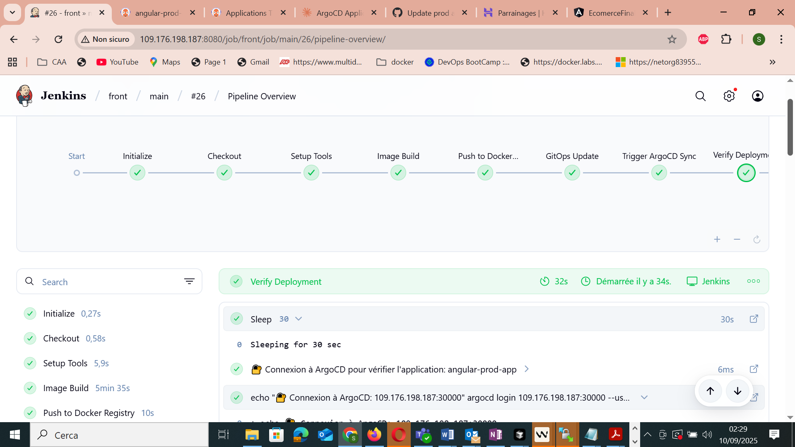
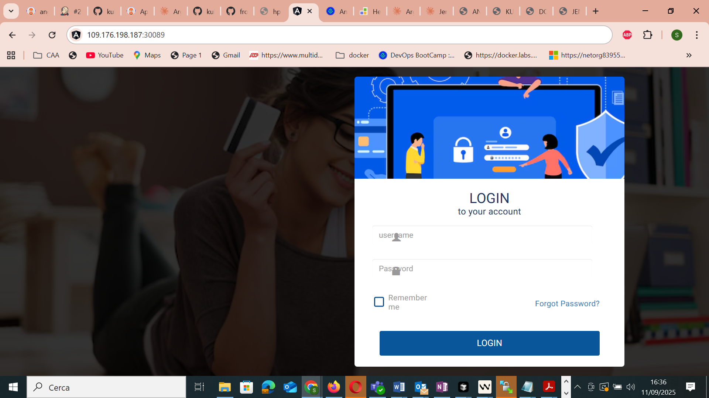
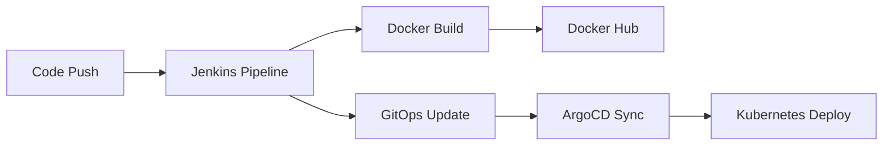

# 🚀 Jenkins Pipeline - GitOps Angular with ArgoCD


> Automated Jenkins pipeline for Angular application deployment using GitOps and ArgoCD

## 📋 Table of Contents

- [Overview](#-overview)
- [Architecture](#%EF%B8%8F-architecture)
- [Environments](#-environments)
- [Installation and Configuration](#-installation-and-configuration)
- [Tools Configuration](#-jenkins-tools-configuration)
- [Secrets Configuration](#-secrets-configuration)
- [Pipeline Stages](#-pipeline-stages)
- [Utility Functions](#-utility-functions)
- [GitOps Structure](#%EF%B8%8F-gitops-structure)
- [Monitoring](#-monitoring-and-verification)
- [Troubleshooting](#%EF%B8%8F-troubleshooting)
- [Metrics](#-metrics)

## 🎯 Overview

This Jenkins pipeline automates the deployment of an **Angular application** using a **GitOps** approach with **ArgoCD** for Kubernetes deployment management.

### 📸 Screenshots

#### Jenkins CI/CD Pipeline

*Overview of the Jenkins pipeline with all deployment stages*

#### Production Application

*Angular application interface deployed in production environment*

#### Development Application

*Angular application interface deployed in development environment*


#### Staging Application (UAT)

*Angular application interface deployed in staging/UAT environment*

### Deployment Flow
```
Angular Code → Jenkins → Docker Hub → GitOps Repository → ArgoCD → Kubernetes
```

## 🏗️ Architecture



## 🌍 Environments

| Git Branch | Environment | Docker Tag | GitOps Branch | URL |
|-------------|-------------|------------|---------------|-----|
| `main`      | **prod**      | `{BUILD}-prod` | `main` | http://109.176.198.187:30089 |
| `develop`   | **uat**       | `{BUILD}-uat`  | `develop` | http://109.176.198.187:30084 |
| `feature/*` | **dev**       | `{BUILD}-dev`  | `feature` | http://109.176.198.187:30083 |

## 🔧 Installation and Configuration

### Prerequisites

- [ ] Jenkins installed and configured
- [ ] Docker installed on Jenkins server
- [ ] Access to a Kubernetes cluster
- [ ] ArgoCD installed and configured
- [ ] GitOps repository prepared

### 📦 Jenkins Tools Configuration

#### 1. Access Global Tool Configuration

```
Jenkins Dashboard → Manage Jenkins → Global Tool Configuration
```

#### 2. Docker Configuration

1. **"Docker" Section**
   - Click **"Add Docker"**
   - **Name**: `dockerlatest`
   - **Install automatically**: ✅
   - **Add Installer** → **"Download from docker.com"**
   - **Docker version**: `latest`

#### 3. Node.js Configuration

> ⚠️ **Prerequisite**: Install "NodeJS Plugin"

1. **"NodeJS" Section**
   - Click **"Add NodeJS"**
   - **Name**: `nodelatest`
   - **Install automatically**: ✅
   - **Version**: LTS (e.g., `18.17.0`)

#### 4. Other Tools (optional)

```bash
# Git
Name: git-latest
Path: /usr/bin/git

# Maven (if needed)
Name: maven-latest
Version: 3.9.4
```

### 🔐 Secrets Configuration

#### Access Credentials

```
Jenkins Dashboard → Manage Jenkins → Manage Credentials 
→ System → Global credentials (unrestricted) → Add Credentials
```

#### 1. Docker Hub Credentials

```yaml
Kind: Username with password
Username: [your-dockerhub-username]
Password: [your-password-or-token]
ID: dockerhubcredential
Description: Docker Hub Credentials
```

#### 2. GitOps Repository Credentials

```yaml
Kind: Username with password
Username: [your-git-username]
Password: [your-github-token]
ID: gitops-credentials-argocd
Description: GitOps Repository Access
```

#### 3. GitHub Token

```yaml
Kind: Username with password
Username: [your-github-username]
Password: [your-personal-access-token]
ID: github-token
Description: GitHub Token for GitOps
```

> 📝 **Create a GitHub Personal Access Token:**
> 1. GitHub → Settings → Developer settings → Personal access tokens
> 2. Permissions: `repo`, `workflow`, `write:packages`

#### 4. ArgoCD Credentials

```yaml
Kind: Username with password
Username: admin
Password: [argocd-password]
ID: argocd-credentials
Description: ArgoCD Login Credentials
```

### 🐳 Docker Installation (Jenkins Server)

```bash
# Docker Installation (Ubuntu/Debian)
sudo apt-get update
sudo apt-get install -y docker.io
sudo systemctl start docker
sudo systemctl enable docker

# Add jenkins to docker group
sudo usermod -aG docker jenkins
sudo systemctl restart jenkins
```

### 🔌 Required Jenkins Plugins

```
Manage Jenkins → Manage Plugins → Available
```

**Essential Plugins:**
- `Docker Pipeline`
- `NodeJS Plugin`
- `Git Plugin`
- `Credentials Plugin`
- `Pipeline Plugin`
- `Blue Ocean` (optional)

## 🚀 Pipeline Stages

### 1. **Initialize**
- Docker and Node.js tools configuration
- System PATH update

### 2. **Checkout**
- Source code retrieval from Git

### 3. **Setup Tools**
- Automatic installation of:
  - `jq` (JSON processing)
  - `ArgoCD CLI`
  - `kustomize` (K8s manifests management)

### 4. **Image Build**
- Docker image build: `angular-app-{ENV}:{TAG}`
- Options: `--pull --no-cache`

### 5. **Push to Docker Registry**
- Docker Hub authentication
- Image tagging and push

### 6. **GitOps Update**
- GitOps repository clone
- Update via kustomize
- Automatic commit and push

### 7. **Trigger ArgoCD Sync**
- Automatic synchronization notification
- ArgoCD detects Git changes

### 8. **Verify Deployment**
- ArgoCD status verification
- Application health check

## 📝 Utility Functions

### `imageBuild(containerName, tag)`
```groovy
// Docker image build with optimized options
sh "docker build -t $containerName:$tag -t $containerName --pull --no-cache ."
```

### `pushToImage(containerName, tag, dockerUser, dockerPassword)`
```groovy
// Authentication and push to Docker Hub
sh "docker login -u $dockerUser -p $dockerPassword"
sh "docker tag $containerName:$tag $dockerUser/$containerName:$tag"
sh "docker push $dockerUser/$containerName:$tag"
```

### `updateGitOpsManifests()`
- GitOps repository clone
- Image update via kustomize
- Commit with standardized message
- Push to appropriate branch

### `verifyArgoCDDeployment(envName)`
- ArgoCD CLI connection
- Health status verification
- Synchronization check
- Debug information display

## 🗂️ GitOps Structure

```
kubernetes-argocd-angular-javasprintboot/
├── apps/
│   └── frontend/
│       └── overlays/
│           ├── dev/
│           │   └── kustomization.yaml
│           ├── uat/
│           │   └── kustomization.yaml
│           └── prod/
│               └── kustomization.yaml
└── README.md
```

## 🔍 Monitoring and Verification

### ArgoCD Status

| Status | Description | Action |
|--------|-------------|---------|
| `Healthy` | ✅ Application successfully deployed | None |
| `Progressing` | 🔄 Deployment in progress | Wait |
| `Degraded` | ⚠️ Issue detected | Check K8s logs |
| `Synced` | ✅ Synchronized with Git | None |
| `OutOfSync` | 🔄 Pending sync | Trigger sync |

### Manual Verification

```bash
# ArgoCD CLI connection
argocd login [ARGOCD_SERVER] --username admin --password [PASSWORD]

# Application status
argocd app get angular-dev-app

# Manual synchronization
argocd app sync angular-dev-app
```

## 🛠️ Troubleshooting

### Common Errors

#### ❌ `docker: command not found`
```bash
# Check Docker installation
docker --version

# Restart services
sudo systemctl restart docker
sudo systemctl restart jenkins
```

#### ❌ `Permission denied` Docker
```bash
# Add jenkins to docker group
sudo usermod -aG docker jenkins
sudo systemctl restart jenkins
```

#### ❌ `kustomize not found`
```bash
# Manual kustomize installation
curl -s "https://raw.githubusercontent.com/kubernetes-sigs/kustomize/master/hack/install_kustomize.sh" | bash
sudo mv kustomize /usr/local/bin/
```

#### ❌ `ArgoCD connection failed`
- Check `argocd-credentials` credentials
- Test network connectivity to ArgoCD server
- Verify SSL certificates (use `--insecure` if necessary)

### Useful Logs

```bash
# Jenkins logs
tail -f /var/log/jenkins/jenkins.log

# ArgoCD logs
kubectl logs -n argocd deployment/argocd-server

# Kubernetes status
kubectl get pods -n [namespace]
kubectl describe pod [pod-name] -n [namespace]
```

## 🔧 Configuration Testing

### Test Jenkins Tools

```groovy
pipeline {
    agent any
    stages {
        stage('Test Tools') {
            steps {
                script {
                    def dockerHome = tool 'dockerlatest'
                    def nodeHome = tool 'nodelatest'
                    sh "${dockerHome}/bin/docker --version"
                    sh "${nodeHome}/bin/node --version"
                }
            }
        }
    }
}
```

### Test Credentials

```groovy
withCredentials([usernamePassword(credentialsId: 'dockerhubcredential', usernameVariable: 'USER', passwordVariable: 'PASS')]) {
    echo "Credentials loaded for user: ${USER}"
}
```

## 📊 Metrics

| Metric | Value | Notes |
|----------|---------|-------|
| **Build time** | 5-10 min | Depends on app size |
| **Deployment time** | 2-5 min | Depends on K8s resources |
| **Environments** | 3 | dev, uat, prod |
| **Supported branches** | ∞ | Auto-detection env |

## 📧 Notifications

Automatic email configuration with:
- ✅ Build status
- 🐳 Docker image information
- 🌐 Application URL
- 📱 ArgoCD app name

## 📋 Deployment Checklist

### Jenkins Configuration
- [ ] Docker tool configured (`dockerlatest`)
- [ ] Node.js tool configured (`nodelatest`)
- [ ] Plugins installed (Docker Pipeline, NodeJS)
- [ ] Email configured (optional)

### Credentials
- [ ] `dockerhubcredential` - Docker Hub
- [ ] `gitops-credentials-argocd` - GitOps repo
- [ ] `github-token` - GitHub token
- [ ] `argocd-credentials` - ArgoCD login

### Infrastructure
- [ ] Docker installed on Jenkins server
- [ ] Jenkins user in docker group
- [ ] ArgoCD accessible
- [ ] GitOps repository configured
- [ ] Kubernetes cluster operational

### Pipeline
- [ ] Jenkinsfile in repository
- [ ] Environment variables defined
- [ ] Utility functions present
- [ ] Unit tests passing

## 🤝 Contribution

1. **Fork** the repository
2. **Create** a feature branch (`git checkout -b feature/improvement`)
3. **Commit** changes (`git commit -am 'Add: new feature'`)
4. **Push** to branch (`git push origin feature/improvement`)
5. **Create** a Pull Request

## 📄 License

This project is under MIT License. See the `LICENSE` file for more details.

## 📞 Support

- 📧 Email: stevy.monkam@yahoo.fr
- 🐛 Issues: [GitHub Issues](https://github.com/stevymonkam/kubernetes-argocd-angular-javasprintboot/issues)
- 📚 Wiki: [Complete Documentation](https://github.com/stevymonkam/kubernetes-argocd-angular-javasprintboot/wiki)

---

⭐ **Don't forget to give a star if this project helps you!**
